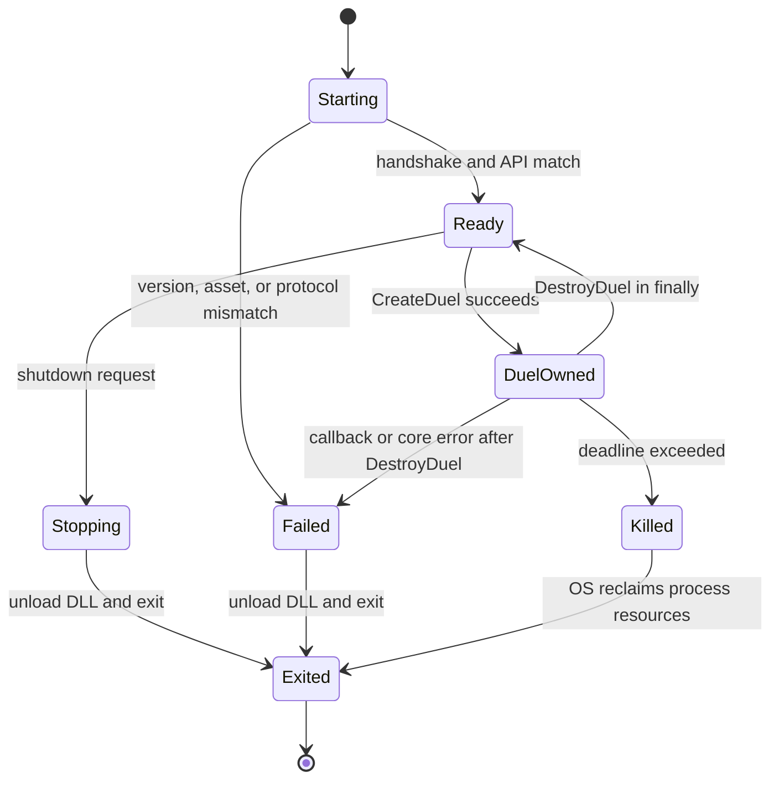

# ADR-0005: ocgcoreをisolated worker processで実行する

Status: Frozen

Date: 2026-07-13

Decision Issue: #87

Evidence: `docs/adr/evidence/0005_ocgcore_isolation.json`

## Context

Python processへ`ocgcore.dll`を直接loadすると、pointer、callback、ABIの誤りだけでなく、ocgcoreまたはLuaのabortとhangがSearch、Replay、Route記録を含むprocess全体へ波及する。一方、worker processはstartup、IPC、payload copy、process pool管理のcostを持つ。固定fixtureをin-processとisolated workerで各100回実行し、latency、memory、crash、hang、callback、API mismatch、final hash、Windows x64 onefile packageを比較した。

fixtureは固定seed `[1, 2, 3, 4]`で`OCG_CreateDuel`と`OCG_DestroyDuel`を実行する。pointer値を除いた結果hashは両方式の全200回で`d934aa06e86bbc7b076257a151123d1ecb5f587cc7fc351ea026944879c3894f`に一致した。

## Decision

production Bridgeはisolated worker process方式を採用する。初期support対象はWindows x64、bindingはworker内の`ctypes`とする。main processはDLLをloadせず、ocgcore pointerとcallback objectを所有しない。将来`cffi`またはnative extensionへ変更してもIPC contractは維持する。

1 workerは同時に1 duelだけを所有する。worker processはSearch開始時にpoolとしてwarm upできるが、duel間でhandle、callback error、raw bufferを共有しない。taskはarrival順ではなく`task_ordinal % pool_size`で割り当て、並列実行の完了順をReplay identityへ含めない。

startup handshakeはIPC schema version、ocgcore API version、core lock ID、asset lock ID、seed、locale、rule configを照合する。不一致はduel作成前にfail-fastする。developmentとpackaged helperは#86のresolverが検証した絶対runtime pathを引数で受け取り、worker自身はdownload、installer起動、path探索を行わない。

production IPCは4-byte little-endian unsigned lengthとUTF-8 canonical JSON envelopeを使い、schema version、request ID、operation、deadline、payloadを必須にする。frame上限は1 MiBとし、超過、truncated frame、unknown schema、request ID不一致をprotocol errorにする。spikeのnewline-delimited JSONは計測用でありproduction contractではない。

ocgcoreのMessage/Query pointerはworker内で上限付きowned `bytes`へ直ちにcopyし、次のcore call前にpointerを破棄する。binary payloadはbase64としてframeへ格納し、decodeとDecisionRequest変換はmain側のpure Python層で行う。これによりdecoderをfixtureだけで検証できる。copy前のpointer、callback payload、hidden card data、raw Message/Queryは既定ログへ出さない。

## Ownership And Cleanup

main processはprocess handle、deadline、request ID、Replay、Route、worker replacementを所有する。workerはDLL handle、callback reference、duel handle、core internal pointer、copy済みresponseを所有する。正常系、structured error、cancelではworkerの`finally`で`DestroyDuel`してからDLLをunloadする。crashとhangではmainがworkerをkillし、OSによるresource回収後に新workerへ置換する。crashしたduelは継続せず、最後のReplay checkpointから再実行する。

## Error Policy

#57の「探索失敗」と「合法な行き止まり」を混同しない。

| Condition | Category | Recovery |
| --- | --- | --- |
| worker abort / unexpected exit | `core_error` + `worker_crash` | worker置換、checkpointから再実行、run失敗を記録 |
| deadline超過 | `timeout` | kill、partial routeとTerminal/Peak Boardを保存 |
| callback例外 | `core_error`またはasset由来なら`asset_error` | C ABIを越えずworker error frameへ変換、duel破棄 |
| API/lock不一致 | `version_mismatch` | startup fail-fast、retryしない |
| malformed/oversize IPC | `invalid_message` + `worker_protocol_error` | worker破棄、診断を保存 |
| candidateが存在しない合法状態 | errorではない | legal stopとしてRouteへ記録 |

worker crash、timeout、unsupported message、version mismatchを「候補なし」へ変換してはならない。公開診断にはcategory、lock ID、request ID、worker exit code、deadline、最後の安全なoperationだけを残す。

## Spike Results

Windows 11 x64、Python 3.13.7、MSVC-built ocgcore API 11.0、PyInstaller 6.20.0 onefile helperで計測した。

| Metric | In-process | Packaged isolated worker |
| --- | ---: | ---: |
| startup | 868.8 us | 626,841.7 us |
| action median | 123.0 us | 286.9 us |
| action p95 | 242.6 us | 412.3 us |
| observed process RSS | 28,278,784 bytes | 8,388,608 bytes |

RSSは既存main process全体とhelper processの絶対値なので、incremental memoryの直接比較には使わない。onefile startupは自己展開を含むため、warm worker poolで償却する。action中央値の隔離costは約163.9 usだった。

native abortではin-process callerがexit code `3221226505`で終了した。isolated workerではmainが生存し、新workerのfixtureが成功した。250 ms hangはin-process callerで外部timeoutが必要だったが、workerはtimeout、kill、replacementに成功した。cardReader callback例外はC ABIを越えず`callback_error`となり、そのworkerは次のfixtureにも成功した。API `99.99`要求はready前に`version_mismatch`となった。

onefile helperは8,273,974 bytesで、SHA-256は`3789ac1ec0936605814417fc430892f55ec1118a06e2c9f5270a6517a03ab147`だった。ocgcore DLLは同梱せず、#86のlocal runtimeを明示指定したため、#61完了前の再配布には該当しない。

## Rejected Alternatives

### In-process ctypes / cffi

action当たり約0.21 ms高速だが、native abortでcaller processが終了し、hangをcaller内から安全に回収できない。Search pool、Replay保存、Route保存を同じprocessへ置くriskに見合わないため却下する。

### In-process native extension

ABI wrapperの型安全性と速度は改善できるが、core/Lua crashとhangのblast radiusは変わらない。binding実装方式でprocess isolation要件を代替できないため却下する。

### 1 workerで複数duelを同時所有

memoryとstartupを節約できるが、callback payload、timeout、cancel、crash時の所有範囲が複雑になり、1 duelの失敗が他duelを巻き込む。初期実装では却下する。

## Consequences

- main processはnative crashとhangから回復し、partial Routeと診断を保存できる。
- worker lifecycleとSearch worker modelが一致し、process単位でparallelismを制御できる。
- core internal bufferは必ずowned bytesへcopyされ、pointer lifetimeをIPCの外へ漏らさない。
- startup約550 ms、action中央値約0.21 ms、base64 copy、process pool管理が追加costになる。
- callbackとduel cleanupの実装責任はworkerへ集中する。
- onefile workerとocgcore DLLは別artifactとして解決し、license判断前はDLLをbundleしない。

## Re-evaluation Conditions

- 実探索profileでIPC/copyがwall timeの5%以上を継続して占める。
- 1 MiBを超える正当なMessage/Queryが確認される。
- Windows以外のsupportで`ctypes` ABIまたはprocess起動modelが成立しない。
- trusted coreのみを使い、crash/hang隔離要件を撤回できる別deploymentが生じる。
- native extensionをworker内へ導入し、IPCを維持したままbindingを置換できる。
